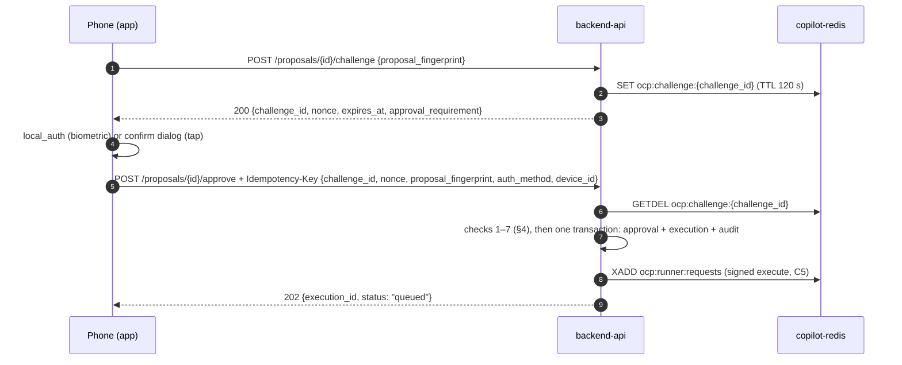

# C8 — Approval protocol

> **Contract:** C8 · **Drafter:** Usman · **Reader:** Tanzeel · **Version:** tracked by `contracts/VERSION`
> **Source:** `docs/architecture.md` §5.9, §7.5, §7.6, §7.10, §10.3–§10.5, ADR-11 · **Requirements:** API-008, API-009, API-010, SEC-001, SEC-012, SEC-017, MOB-008, MOB-009, MOB-010, MOB-015, TEST-005, TEST-006
> **Models:** `python/oncallpilot_contracts/approval.py` → `schemas/challenge_request.json`, `challenge_response.json`, `approve_request.json`, `approve_accepted.json`, `reject_request.json`, `reject_response.json`. **Endpoints:** `openapi.yaml` (C2).
>
> Changing a step, a check, its order, or an error code is a contract change (`CLAUDE.md` §8.4).

---

## 1. Flow



Nothing executes without an `approvals` row with `decision = approved`. A database trigger enforces this for every execution (SEC-001).

## 2. Fingerprints

| Name | Computed by | Over | Used for |
|---|---|---|---|
| `state_fingerprint` | runner (dry run, and again just before acting) | the active release and desired replica count from the ledger, plus the sorted names of the target containers; restart counts and other volatile fields are left out (§7.5) | drift detection: a mismatch aborts with `STATE_DRIFT` (RUN-008) |
| `proposal.fingerprint` | backend-worker, when it stores the proposal | `sha256(canonical_json({proposal_id, action, params, risk_tier, state_fingerprint, dry_run_at}))`, lower-case hex; `canonical_json` as in C5 (`signing.py`) | the app echoes it in `challenge` and `approve`; a mismatch is `409 STALE_PROPOSAL` |

The app never computes a fingerprint. It sends back the `fingerprint` of the latest version of the proposal it has received (REST or `proposal.created`).

## 3. Step 1 — challenge

`POST /proposals/{id}/challenge` with body `{"proposal_fingerprint": "<sha256 hex>"}`.

| Order | Check | Error |
|---|---|---|
| 1 | Valid JWT | `401 UNAUTHORIZED` |
| 2 | Proposal exists | `404 NOT_FOUND` |
| 3 | Proposal is `pending` | `409 PROPOSAL_NOT_PENDING` |
| 4 | Not past `expires_at` | `409 PROPOSAL_EXPIRED` |
| 5 | `proposal_fingerprint` equals the stored fingerprint | `409 STALE_PROPOSAL` |

On success the server stores `ocp:challenge:{challenge_id} = {user_id, proposal_id, nonce_hash, fingerprint}` with a 120 s TTL, writes `audit(challenge.issued)`, and returns:

```json
{"challenge_id": "2b7c4e1a-6d3f-4a8b-9c05-7e1d2f4a6b83",
 "nonce": "9f0c3e5a7b1d2f4e6a8c0b3d5f7e9a1c2b4d6f8e0a3c5e7b9d1f2a4c6e8b0d3f",
 "expires_at": "2026-10-14T09:03:55Z",
 "approval_requirement": "biometric"}
```

- `nonce` is 32 random bytes as 64 lower-case hex characters. Only its SHA-256 is stored.
- A challenge is **single use** (consumed with `GETDEL` by the approve call), lasts **120 s**, and is bound to the user, the proposal, and the fingerprint (SEC-012).

## 4. Step 2 — local confirmation (app)

| `approval_requirement` | Tier | What the app does |
|---|---|---|
| `biometric` | medium, high | `local_auth.authenticate` with `biometricOnly: true`. With no biometric enrolled, the app blocks the approval and explains why; it **never** falls back to PIN or tap (MOB-009). |
| `tap` | low | An explicit confirm dialog. |

**Approve is enabled only when all of these hold** (MOB-015, architecture §10.4): the connection is `connectedSynced`; the proposal `status` is `pending`; it has not expired by **server** time (`hello.server_time` offset, NFR-014); and the fingerprint shown equals the latest one received. **Reject stays enabled** even when the view is stale (MOB-010).

## 5. Step 3 — approve

`POST /proposals/{id}/approve` with the header `Idempotency-Key: <uuid4>` and the body:

```json
{"challenge_id": "2b7c4e1a-6d3f-4a8b-9c05-7e1d2f4a6b83",
 "nonce": "9f0c3e5a7b1d2f4e6a8c0b3d5f7e9a1c2b4d6f8e0a3c5e7b9d1f2a4c6e8b0d3f",
 "proposal_fingerprint": "<the fingerprint from the challenge request>",
 "auth_method": "biometric",
 "device_id": "00000000-0000-4000-8000-000000000053"}
```

`device_id` is optional: the app always sends it, while API clients such as `ocp smoke` may leave it out.

The server runs these checks **in this order**; the first failure is returned (architecture §5.9 step 4):

| Order | Check | Error |
|---|---|---|
| 0 | Valid JWT; proposal exists; `Idempotency-Key` header present | `401 UNAUTHORIZED`; `404 NOT_FOUND`; `400 IDEMPOTENCY_KEY_REQUIRED` |
| 1 | Key seen before → replay the stored response. Same key with a different body → error | `422 IDEMPOTENCY_CONFLICT` |
| 2 | Challenge valid: for this user and proposal, unused, unexpired → consumed with `GETDEL` | `409 CHALLENGE_INVALID` |
| 3 | `proposal_fingerprint` matches | `409 STALE_PROPOSAL` |
| 4 | Proposal `pending` and not expired | `409 PROPOSAL_NOT_PENDING` / `409 PROPOSAL_EXPIRED` |
| 5 | Tier medium or high → `auth_method` is `biometric` | `403 BIOMETRIC_REQUIRED` |
| 6 | Rate limit: at most 3 executed actions per service per 30 min | `429 RATE_LIMITED` (`details.retry_after`, seconds) |
| 7 | No cooldown: 120 s after an execution on the service finished; rollback proposals are exempt | `429 COOLDOWN_ACTIVE` (`details.retry_after`, seconds) |

Then, in **one transaction**: insert the approval (`approved`) and the execution (`queued`), set the proposal to `approved` and the incident to `executing`, and write the audit rows. After the commit, the server sends the signed `execute` request (C5) and answers `202 {"execution_id": "…", "status": "queued"}`.

**Idempotency** (TEST-005):
- The key is a UUID v4, generated once per approval attempt. The server stores the response (success or error) with a hash of the request body for 24 h.
- Retry with the **same** key only when no response arrived (a network error or timeout). A double tap therefore produces one execution.
- After **any** error response, start again from step 1 with a new challenge and a new key: the challenge was already consumed by check 2.

## 6. Reject

`POST /proposals/{id}/reject` with the header `Idempotency-Key: <uuid4>` and `{"reason": "…"}` (3–500 characters). It needs no challenge and no biometric.

| Check | Error |
|---|---|
| Valid JWT; proposal exists; `Idempotency-Key` present | `401`; `404 NOT_FOUND`; `400 IDEMPOTENCY_KEY_REQUIRED` |
| Same key with a different body | `422 IDEMPOTENCY_CONFLICT` |
| Reason 3–500 characters | `422 VALIDATION_ERROR` |
| Proposal `pending` | `409 PROPOSAL_NOT_PENDING` |

The effect is: approval `rejected` (with the reason), proposal `rejected`, incident `escalated` (`proposal_rejected`), and audit `approval.rejected`. Nothing runs, and the evidence stays. The response is `200 {"proposal_id": "…", "status": "rejected"}`.

## 7. Error codes and what the app shows (MOB-008)

| Code | Message (suggested) | App action |
|---|---|---|
| `STALE_PROPOSAL` | "Proposal changed — review again" | Refetch the incident; show the new proposal |
| `PROPOSAL_EXPIRED` | "This proposal expired" | Refetch; Approve stays disabled |
| `PROPOSAL_NOT_PENDING` | "Already decided" | Refetch |
| `CHALLENGE_INVALID` | "Approval timed out — try again" | Start again from step 1 |
| `BIOMETRIC_REQUIRED` | "Fingerprint or face confirmation is required" | Run `local_auth` |
| `RATE_LIMITED`, `COOLDOWN_ACTIVE` | "Too many actions on this service — wait N s" | Show `details.retry_after` |
| `IDEMPOTENCY_CONFLICT`, `IDEMPOTENCY_KEY_REQUIRED` | "Something went wrong — try again" | Start a new attempt (a client bug if seen) |

## 8. What the server records (SEC-017)

`audit(approval.approved)` snapshots exactly what the engineer saw: the proposal fingerprint, the dry-run result, the top hypothesis summary and confidence, the cited evidence refs, `auth_method`, and `device_id` (when sent).

## 9. Limitation (stated openly)

The server cannot verify that a biometric was used: `local_auth` returns only a local boolean, so a modified client could claim `auth_method: biometric` (architecture §7.10, limitation L2). The single-use nonce, fingerprint binding, rate limit, and cooldown still apply.
