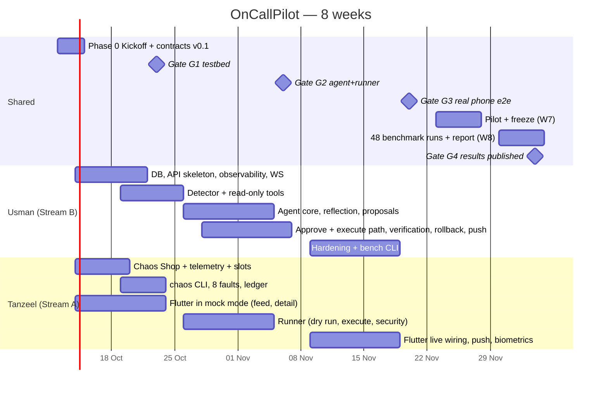
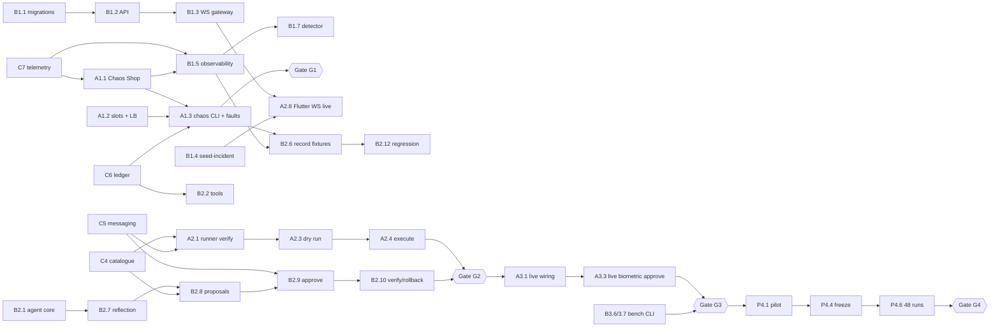

# OnCallPilot — Implementation Roadmap (two developers, ~8 weeks)

> **Developers:** **Usman** owns Stream B (backend, AI agent, database, observability, benchmark harness). **Tanzeel** owns Stream A (Flutter app, Chaos Shop testbed, chaos CLI, runner, `socket-proxy-rw`; Usman owns `socket-proxy-ro` with the observability stack).
> **Rule of thumb:** neither developer ever waits on the other for more than a day. Every cross-stream dependency has a contract, a fixture, and a fake (§3, §4).
> **Integration host:** Tanzeel's laptop (16 GB RAM), on a Wi‑Fi network the team controls. Each developer can also run the full stack locally.
> Requirement IDs (e.g. `RUN-011`) refer to `requirements.md`; § references point to `architecture.md`.

---

## 1. Ownership map

| Area | Owner | Folder | Tell about contract-sensitive changes |
|---|---|---|---|
| Contracts (models, OpenAPI, WS protocol, actions, telemetry, ledger) | **Both** | `contracts/` | Both |
| Database schema and migrations | Usman | `supabase/migrations/` | Tanzeel |
| backend-api (REST, WebSocket, approvals, push sender) | Usman | `backend/oncallpilot/api/`, `approvals/`, `push/` | Tanzeel for approvals |
| backend-worker (detector, agent, tools, providers, verifier) | Usman | `backend/oncallpilot/worker/`, `detector/`, `agent/` | Tanzeel for `agent/tools/` |
| Observability (Prometheus, Loki, Alloy, Grafana, socket-proxy-ro) | Usman | `infrastructure/observability/` | Tanzeel |
| Runbooks | Both (Usman ingests) | `runbooks/` | The developer who did not write it |
| Benchmark harness (`bench` CLI, scenarios, report) | Usman | `benchmark/` | Tanzeel |
| Chaos Shop (api, worker, payments, loadgen, nginx, Postgres, Redis) | Tanzeel | `chaos-shop/` | Usman for telemetry |
| chaos CLI, deploy ledger writer | Tanzeel | `chaos-shop/cli/` | Usman for ledger format |
| Runner and socket-proxy-rw | Tanzeel | `runner/`, `infrastructure/compose/runner.yml` | Usman (security-critical) |
| Flutter app | Tanzeel | `mobile/` | Usman for API usage |
| Root compose, `ocp` CLI, CI | Both | `compose.yaml`, `tools/ocp/`, `.github/` | Both |

---

## 2. Timeline at a glance

*Dates are placeholders that assume kickoff on Monday 12 October 2026; shift them all if you start on a different day. Only the week numbers are binding.*

| Week | Usman (Stream B) | Tanzeel (Stream A) | Friday checkpoint (on Tanzeel's laptop) |
|---|---|---|---|
| 1 | Phase 0 → migrations, API skeleton, `ocp seed-incident`, observability compose | Phase 0 → Chaos Shop services + telemetry, Flutter skeleton + mock feed | Stack boots with one command; phone reaches the laptop over Wi‑Fi |
| 2 | Ingestion, WebSocket gateway, detector v1, Grafana dashboard, first tools | Slots, releases, chaos CLI (8 faults), ledger, fault persistence; Incident Detail in mock mode | **Gate G1** |
| 3 | Agent core, FakeProvider, all tools, redaction, runbooks, Gemini adapter, record fixtures; **scenario 2 path first**: proposal with dry run, challenge and approve, signed execute, result consumer | Runner consumer, signing, catalogue, dry runs, proxy security; **`rollback_deploy` execute and structural health check first**; Action Review + approval flow in mock mode; WS client | Phone shows seeded incidents over the live WebSocket; runner dry-runs signed test messages; **thin slice** (`ocp smoke --thin`, see Phase 2) |
| 4 | Reflection, proposals for all 8 scenarios, two-stage verification, rollback proposals, expiry and drift handling, FCM; pin LLM model | Remaining execute handlers (restart, scale, clear_cache), progress, idempotency, limits, drift; Execution Status in mock mode | **Gate G2** |
| 5 | Stale and expiry flows, log tail, audit, settings, injection hardening, latency; `bench plan/run/mark` | Live repository wiring, FCM, biometric approve live, stale gate, reconnect; device tests | Scenario 2 approved from the phone |
| 6 | `bench audit-*` and `report`, pilot of 2 scenarios, Claude adapter if not done | Audit History, Settings, error UX, widget tests; all 8 scenarios on the phone | **Gate G3** |
| 7 | Pilot runs (not counted), fixes, freeze, README | Pilot runs, fixes, demo storyboard, clean-machine test | `bench-freeze` tag |
| 8 | 48 counted runs, evidence and safety audits, report | 48 counted runs, demo video | **Gate G4** |

---

## 3. Contracts to agree in Phase 0

Contracts are the reason two people can work in parallel. Each has a **drafter**, a **reader** (the other developer, who checks it fits and flags problems but does not need to approve), and a deadline. All live in `contracts/`, versioned by `contracts/VERSION` (starts at `0.1.0`), and change only through `contract/*` PRs (`CLAUDE.md` §8).

| ID | Contract | Contents | Drafter → Reader | Deadline | Unblocks |
|---|---|---|---|---|---|
| C1 | Domain models | Pydantic: `Incident*`, `Evidence`, `Hypothesis`, `Proposal`, `DryRunResult`, `Approval`, `Execution`, `AuditEntry`, `Device`, `MonitorSettings`, enums (§8.2) → JSON Schema | Usman → Tanzeel | Day 2 | Dart DTOs, API, mock mode |
| C2 | REST API | `contracts/openapi.yaml` for every endpoint in §9.2, including error codes | Usman → Tanzeel | Day 3 | Mobile repositories, API implementation |
| C3 | WebSocket protocol | `ws-protocol.md`: auth, hello, ping, resume, resync, 8 events; event fixtures | Usman → Tanzeel | Day 3 | Mobile WS client, gateway |
| C4 | Action catalogue | `actions.yaml`: 5 actions, parameter schemas, tiers, approval, rollback steps, `enabled` | Tanzeel → Usman | Day 2 | Agent validator, runner handlers, Action Review UI |
| C5 | Runner messaging | Request and result models (§9.5), canonical JSON, two-key HMAC test vectors in `fixtures/signing/` | Usman → Tanzeel | Day 3 | Runner consumer, approve endpoint |
| C6 | Deploy ledger | `DeployRecord` model (§9.6), file location, `kind` values, seeded-history format | Tanzeel → Usman | Day 3 | `get_recent_deploys`, chaos CLI, runner |
| C7 | Telemetry | Metric names and labels, log JSON fields (§11.2), Docker labels | Tanzeel → Usman | **Day 2** | Instrumentation, Prometheus config, detector, tools |
| C8 | Approval protocol | Challenge → local_auth → approve; fingerprint; Idempotency-Key; error codes | Usman → Tanzeel | Day 3 | Approval flow on both sides |
| C9 | Push payload | Keys, types, channel (§9.7) | Usman → Tanzeel | Day 3 | FCM client and sender |
| C10 | Benchmark records | `scenarios.yaml` schema, CSV columns (`BENCH-007`) | Usman → Tanzeel | End of Week 2 | bench CLI, chaos CLI names |

**Phase 0 fixtures (both developers):** three full incident timelines in `contracts/fixtures/timelines/`:
1. `bad_deploy_success.json`: opened → evidence ×5 → hypotheses → reflected → proposal → approved → progress → resolved.
2. `slow_dependency_escalated.json`: escalated with `no_catalogue_action_fits`.
3. `scale_failed_rollback.json`: `action_failed` → rollback proposal → approved → resolved (`rolled_back`).

These drive Tanzeel's mock mode **and** Usman's WebSocket gateway tests.

**Decisions** (`architecture.md` §0): every ADR is settled, so nothing waits for a meeting.
- **ADR-14** embeddings are decided (`gemini-embedding-001`, 768 dimensions), so the first migration can use `vector(768)` straight away.
- **ADR-13** the LLM provider is decided (Gemini primary, Claude fallback). Only the exact model ID is chosen later: written into `.env.example` in task B2.5, pinned in task B2.13 by the end of Week 4, and frozen at `bench-freeze`.
- To change any other decision, add a new ADR in `docs/adr/` first (`CLAUDE.md` §2).

---

## 4. What can be mocked or stubbed

| Fake | Built by | Used by | Replaces |
|---|---|---|---|
| `MockIncidentRepository` (fixture timeline replay, simulated error codes) | Tanzeel | Tanzeel | The whole backend, until Week 3 |
| `ocp seed-incident <timeline>`: writes a fixture timeline into the real database and publishes its events | Usman | Tanzeel (live WS testing in Week 3), Usman (gateway tests) | Detector + agent |
| Synthetic alert: `curl POST /ingest/alert` with a fixture body | Usman | Both | Detector |
| `FakeProvider` (scripted LLM turns) | Usman | Usman, CI | Gemini or Claude |
| Recorded tool fixtures (captured from the live testbed in Week 3) | Usman | Agent regression suite | Prometheus, Loki, Docker, ledger |
| `FakeRunnerConsumer` (answers dry runs, emits progress and success or failure on demand) | Usman | Usman (approval, verification, rollback tests) | Real runner |
| `publish_signed.py` (publishes signed requests to Redis using the shared test vector key) | Tanzeel | Tanzeel | backend-api approve path |
| `FakeDockerClient` | Tanzeel | Runner unit tests | socket-proxy-rw |
| Fixture deploy ledger | Tanzeel | Usman (`get_recent_deploys`) | chaos CLI |
| FCM fake (records messages) | Usman | Backend tests | Firebase |
| Firebase console test message | Tanzeel | Tanzeel | Backend push sender |

---

## 5. Phases

### Phase 0 — Kickoff and contracts (Week 1, days 1–3)

**Objective:** agree every interface so both streams can start without waiting.

| | Tasks |
|---|---|
| **Shared** | S0.1 Kickoff: both developers read all five documents and the Week 1 plan (all ADRs are already settled in `architecture.md` §0). · S0.2 Repo skeleton (§3 of `CLAUDE.md`), CODEOWNERS (informational only), branch protection (required CI checks only, no required reviewers), PR template. · S0.3 CI skeleton (empty workflows that pass). · S0.4 Contracts C1–C9 v0.1 plus 3 timeline fixtures plus signing vector. · S0.5 **Network spike (day 1):** a hello-world FastAPI on Tanzeel's laptop reached from the Android phone over the chosen Wi‑Fi, with the Windows Firewall rule. · S0.6 Docker Desktop set up on both laptops (disk image moved off C: where space is tight). · S0.7 **Assumption spike (days 1–3, about 3 hours, results in `docs/checks/proxy.md`):** prove the outside behaviours the design depends on before anything is built on them. (a) Run `socket-proxy-ro` and `socket-proxy-rw` with the exact settings in `architecture.md` §2.11 and `LOG_LEVEL=debug`. Check that Alloy `discovery.docker` plus `loki.source.docker` work through the ro proxy and see which endpoints it calls (this decides whether `NETWORKS=1` stays); check that a throwaway container can be started, stopped, and restarted through the rw proxy using a Docker SDK client with an explicit `version=`; check that create, exec, and delete return 403. Record the `docker version` API value you pinned. (b) Start nginx ≥ 1.27.3 with `zone`, `resolver 127.0.0.11`, and `server … resolve` against a Docker network alias; start and stop a second container behind the alias and watch nginx pick it up without a reload. (c) Call `gemini-embedding-001` with `output_dimensionality=768` and confirm the vector length is 768 and that it needs manual normalisation. (d) Log in to the `ocp-dev` Supabase project and verify the token through the live JWKS. If any check fails, fix the design in `architecture.md` the same day and tell Claude Code which section changed. |
| **Usman** | B0.1 Create Supabase projects `ocp-dev` and `ocp-bench`; disable sign-ups; create user accounts (one per developer, plus a test user for `ocp smoke` and `bench`, `OCP_TEST_EMAIL` in `CLAUDE.md` §10.2); **switch both projects to an asymmetric JWT signing key** (otherwise the JWKS has no public key and backend auth cannot work). · B0.2 Draft C1, C2, C3, C5, C8, C9. · B0.3 Get LLM and embedding API keys. |
| **Tanzeel** | A0.1 Create the Firebase project; add the Android app; download `google-services.json`. · A0.2 Draft C4, C6, C7. · A0.3 `flutter create` with package name, minSdk, `FlutterFragmentActivity`, network security config. |

- **Deliverables:** `contracts-v0.1.0` tag; green CI skeleton; network spike result recorded in `docs/checks/network.md`.
- **Dependencies:** none.
- **Definition of done:**
  - all contracts merged and read by the other developer;
  - Python fixtures validate against the schemas;
  - Dart parses the fixtures (a stub test is fine at this point);
  - the phone reached the laptop.
- **Integration checkpoint:** end of day 3, a 30-minute walkthrough of the fixtures on both sides.

---

### Phase 1 — Testbed and foundations (Weeks 1–2) · Gate G1

**Objective:** a breakable, observable Chaos Shop, plus the skeletons of every other part, running from one command.

**Usman (Stream B)**

| ID | Task | Req IDs |
|---|---|---|
| B1.1 | Migrations: all 10 tables, enums, triggers, grants, RLS, `ocp` schema; CI applies them to a pgvector container | DB-001…DB-014, TEST-016 |
| B1.2 | backend-api skeleton: settings, JWKS auth, error envelope, `/healthz`, `GET /incidents`, `GET /incidents/{id}` | API-001, API-002, API-004, API-005, SEC-010 |
| B1.3 | copilot-redis with ACL users; `ocp:events` publisher; `/ws/incidents` (auth, hello, ping, resume, resync) | API-014…API-017, SEC-004 |
| B1.4 | `ocp seed-incident` (fixture timeline → database + events) | §4 |
| B1.5 | Observability compose: Prometheus (DNS service discovery), Loki, Alloy (via socket-proxy-ro), Grafana with provisioned dashboard | TB-012, SEC-014 |
| B1.6 | `POST /ingest/alert`, dedupe, severity, window, seed evidence, agent job enqueue | FR-004…FR-007, API-003 |
| B1.7 | Detector v1: signals, EWMA and z-score, floors, warm-up, recovery; unit tests on synthetic series | FR-001…FR-003, FR-011 |
| B1.8 | Start `query_logs` and `query_metrics` against the live baseline | AI-005, AI-006 |

**Tanzeel (Stream A)**

| ID | Task | Req IDs |
|---|---|---|
| A1.1 | Chaos Shop api, worker, payments, Postgres, Redis, loadgen with the C7 telemetry contract | TB-001, TB-003…TB-005 |
| A1.2 | `cs-lb` nginx with upstream `resolve`; slot containers with labels and aliases; releases 1.4.0, 1.5.0, 2.1.0, 2.2.0 | TB-002, TB-011 |
| A1.3 | chaos CLI: `reset`, `status`, `inject` ×8, `verify`; seeded deploy ledger; fault persistence mechanics (§11.3) | TB-006…TB-010 |
| A1.4 | Calibrate the traffic spike: 1 replica saturates, 3 recover, on Tanzeel's laptop | TB-005 |
| A1.5 | Flutter skeleton: env config, go_router, theme, login, secure session storage, `MockIncidentRepository` | MOB-001, MOB-002, MOB-017 |
| A1.6 | Incident Feed and Incident Detail (hypotheses, `E#` chips, evidence cards with fl_chart) in mock mode | MOB-003…MOB-005 |

**Shared:** S1.1 root `compose.yaml` and `ocp up`; S1.2 first runbooks (the author is not the reviewer).

**Parallelizable work**
- **Usman, without waiting for Tanzeel:**
  - B1.1–B1.4, B1.6, and B1.7 need nothing from the testbed; the detector is unit-tested on synthetic series.
  - B1.5 needs only the C7 contract until the Chaos Shop skeleton exists (mid Week 1).
- **Tanzeel, without waiting for Usman:**
  - all of A1.1–A1.4 (the testbed depends only on the C7 contract he drafted);
  - all Flutter work in mock mode.

**Interfaces used:** C1–C9 (v0.1); the testbed work depends most on C6 and C7.

**Gate G1 (end of Week 2), "all 8 faults run from one command":**
1. `ocp up` on Tanzeel's laptop brings everything to healthy.
2. `chaos inject <n>` works for all 8 scenarios; `chaos reset` restores the baseline in ≤ 90 s.
3. `chaos verify 1..6` passes; scenarios 7 and 8 persist for 15 minutes.
4. Each scenario is visible in Grafana or Loki Explore (screenshots in `docs/checks/gate-g1.md`).
5. The detector opens an incident for at least scenarios 2, 4, and 6 (a stretch goal for G1, required for G2).

**Integration checkpoints:**
- Friday W1: stack boots; phone reaches the laptop.
- Friday W2: Gate G1 walkthrough.

---

### Phase 2 — Agent and runner (Weeks 3–4) · Gate G2

**Objective:** every fault produces a diagnosis and either a proposal or a correct escalation, and approved actions really execute safely.

**Usman (Stream B)**

| ID | Task | Req IDs |
|---|---|---|
| B2.1 | Agent state machine, `AgentEffects`, budgets, FakeProvider | AI-001…AI-003 |
| B2.2 | Complete tools: `get_recent_deploys`, `get_service_health` (projection), `search_runbooks`; runbook ingestion; embedding provider | AI-007…AI-009, AI-026, AI-027 |
| B2.3 | Redaction module plus corpus; untrusted-data wrapping; suspicious flag | SEC-008, AI-011, AI-028, TEST-008 |
| B2.4 | Evidence storage, references, events; hypothesis generation; structured output with one repair | AI-010, AI-012, AI-013, AI-020 |
| B2.5 | Gemini adapter (primary per ADR-13); choose the exact model ID and write it to `.env.example`; prompt v1 and manifest | AI-021…AI-023 |
| B2.6 | **Record tool fixtures** from the live testbed for all 8 scenarios (with Tanzeel injecting) | TEST-002 |
| B2.7 | Reflection: citation rules, disproof query, confidence rules, threshold | AI-014…AI-017 |
| B2.8 | Proposal validation against the catalogue and live targets; dry-run request flow; escalation paths | AI-018, AI-019, FR-010 |
| B2.9 | Challenge, approve, and reject endpoints (checks in order); idempotency; rate limit and cooldown; signed execute | API-008…API-010, SEC-001…SEC-003, SEC-012 |
| B2.10 | Runner-result consumer and result handling; two-stage verification; rollback proposals; drift supersede; expiry and runner-timeout sweeper | FR-013…FR-017, FR-024 |
| B2.11 | FCM sender; device endpoints | FR-018, API-011 |
| B2.12 | Agent regression suite (8 scenarios, FakeProvider) | TEST-002 |
| B2.13 | **Pin the LLM model** (ADR-13 rule: keep the primary if Gate G2 criterion 1 passes; otherwise switch to the Claude adapter) | — |

**Tanzeel (Stream A)**

| ID | Task | Req IDs |
|---|---|---|
| A2.1 | Runner: consumer group, signature and expiry verification (shared vector), catalogue and target allowlist, free-form rejection | RUN-001…RUN-004, RUN-018 |
| A2.2 | socket-proxy-rw config; proxy security tests | RUN-017, TEST-015 |
| A2.3 | Dry runs for all 4 actions; state fingerprint | RUN-007 |
| A2.4 | Execute handlers: restart, scale, rollback, clear_cache; ledger append; progress events; signed results | RUN-009…RUN-013, RUN-015 |
| A2.5 | Idempotency, second-gate limits, drift abort, structural health check; isolation hardening | RUN-005, RUN-006, RUN-008, RUN-014, RUN-016 |
| A2.6 | Forbidden-action test suite | TEST-004 |
| A2.7 | Flutter: Action Review, approval controller (challenge → local_auth → approve) in mock mode | MOB-007…MOB-010 |
| A2.8 | Flutter: WebSocket client (backoff, resume, resync) against the **real** gateway with seeded incidents | MOB-014 |
| A2.9 | Flutter: Execution Status in mock mode | MOB-011 |

**Shared:** S2.1 `ocp smoke` (scenario 2 end to end through the API); S2.2 runbooks complete and cross-reviewed; S2.3 scenario recording session for B2.6 (Tanzeel injects, Usman records; about 2 hours); S2.4 **thin slice** (see below).

**Build order inside Phase 2 (so the thin slice is possible):** both developers build the scenario 2 path first and widen afterwards.
- Usman: B2.9 (challenge, approve, signed execute) and the result consumer from B2.10 come **before** reflection and the other seven scenarios. Approval checks are implemented in full from the start; nothing is relaxed for the slice.
- Tanzeel: the `rollback_deploy` execute handler and structural health check from A2.4/A2.5 come before `restart_service`, `scale_service`, and `clear_cache`.

**Thin slice (S2.4, Friday of Week 3):** `ocp smoke --thin` runs scenario 2 once through the real components: inject → detector opens the incident → agent (FakeProvider is allowed) proposes `rollback_deploy` with a real dry run → the script calls `challenge` and `approve` through the API with `auth_method: biometric`, because the catalogue requires it for this action → signed `execute` → runner rolls back → structural health check passes → incident `resolved`.
- Purpose: find signing, Redis ACL, proxy, and fingerprint problems three weeks before the end, instead of at Gate G2.
- Not allowed in the slice: skipping approval, an auto-approve flag, or relaxing any check in `CLAUDE.md` §6.
- Allowed in the slice: reflection and signal verification may still be stubs. Both are required from Gate G2.
- It is a checkpoint, not a gate. If it slips, it must run by Wednesday of Week 4 and the cause goes into `docs/checks/week-3.md`.

**Parallelizable work**
- **Usman, without waiting for Tanzeel:**
  - B2.1, B2.3, B2.4, B2.5, B2.7, and B2.8 run on FakeProvider and fixtures;
  - B2.9–B2.10 are tested against `FakeRunnerConsumer`;
  - B2.11 is tested with the FCM fake.
- **Tanzeel, without waiting for Usman:**
  - A2.1–A2.6 are driven by `publish_signed.py` and the signing vector; no backend is needed;
  - A2.7 and A2.9 use mock mode;
  - A2.8 only needs the WebSocket gateway, which exists since Week 2.

**Interfaces used:** C4 (catalogue), C5 (messaging and signing), C6 (ledger), C8 (approval protocol).

**Gate G2 (end of Week 4), "every fault gets a diagnosis and proposal":**
1. With the real LLM, each scenario produces either a proposal whose action matches `scenarios.yaml` or, for 7 and 8, an escalation, in at least 6 of 8 single runs. Misses are logged.
2. Approving through `ocp smoke` (API, no phone) executes the action; the two-stage health check resolves the incident for scenarios 1–6.
3. TEST-003, TEST-004, TEST-005, and TEST-015 are green.
4. The agent regression suite is green in CI; `agent_meta` is complete.
5. The LLM model is pinned.

**Integration checkpoints:**
- Friday W3: live WebSocket events on the phone from seeded incidents; runner dry runs from signed test messages; tool fixtures recorded; thin slice (S2.4) run with `ocp smoke --thin`.
- Friday W4: Gate G2 walkthrough with `ocp smoke`.

---

### Phase 3 — Mobile integration and hardening (Weeks 5–6) · Gate G3

**Objective:** the real phone completes the loop, every edge case behaves safely, and the benchmark harness is ready.

**Usman (Stream B)**

| ID | Task | Req IDs |
|---|---|---|
| B3.1 | Stale and expiry hardening; fingerprint 409 paths; state_version ordering | TEST-006, FR-013 |
| B3.2 | `/log-tail`, `/audit`, `/settings`, `/incidents/{id}/resolve`, `DELETE /devices` | API-006, API-007, API-011…API-013 |
| B3.3 | Prompt-injection hardening against live scenario 8; prompt v2 if needed (manifest bump) | TEST-003, AI-023 |
| B3.4 | Latency tuning for alert-to-proposal ≤ 60 s (parallel tool calls where the LLM allows, smaller reflection calls) | NFR-001 |
| B3.5 | Copilot `/metrics` and a "Copilot internals" Grafana panel | NFR-006 |
| B3.6 | `bench plan`, `bench run`, `bench mark`, CSV writer; `PROCEDURE.md` | BENCH-002…BENCH-007 |
| B3.7 | `bench audit-evidence`, `bench audit-safety`, `bench report` (matplotlib) | BENCH-008…BENCH-011, BENCH-013 |
| B3.8 | Second LLM adapter, if not done in Phase 2 | AI-021 |
| B3.9 | Procedure dry run: 2 scenarios × 2 modes | BENCH-004 |

**Tanzeel (Stream A)**

| ID | Task | Req IDs |
|---|---|---|
| A3.1 | `LiveIncidentRepository` for every screen; DTO contract tests | MOB-020 |
| A3.2 | FCM: permission, token registration, channel, deep links | MOB-016 |
| A3.3 | Live approval with biometrics on the real device; error-code UX | MOB-008, MOB-009 |
| A3.4 | Stale-state gate (banner, Approve disabled), server-clock countdowns | MOB-015, NFR-014 |
| A3.5 | Audit History, Settings (with lock), suspicious chip, live log tail | MOB-006, MOB-012, MOB-013, MOB-019 |
| A3.6 | Widget tests for every screen and state | TEST-011 |
| A3.7 | Run all 8 scenarios from the phone; fix UX issues | — |
| A3.8 | Demo storyboard (2-minute script) | — |

**Shared:** S3.1 crash-resilience test (kill runner, worker, or API mid-flow) (`NFR-005`); S3.2 README architecture and safety sections drafted.

**Parallelizable work**
- **Usman, without waiting for Tanzeel:**
  - B3.1–B3.5 are tested through the API and integration tests;
  - B3.6–B3.7 are built against a synthetic CSV and the stack.
- **Tanzeel, without waiting for Usman:**
  - A3.4–A3.6 can be finished against mock mode first;
  - A3.2 is tested with Firebase console messages before backend pushes.

**Gate G3 (end of Week 6), "approve on a real phone, end to end":**
1. With the app killed, scenario 2 injection produces a push; the tap opens the incident; biometric approval leads to the rollback executing and the incident resolving. The run is recorded as a draft demo clip.
2. Turning Wi‑Fi off on the phone during review shows the stale banner and disables Approve; reconnecting re-syncs.
3. A double tap on Approve produces one execution.
4. All screens are wired live; widget tests are green.
5. The bench procedure dry run completed without manual database edits.

**Integration checkpoints:**
- Friday W5: scenario 2 from the phone.
- Friday W6: Gate G3.

---

### Phase 4 — Proof (Weeks 7–8) · Gate G4 · **never skipped**

**Objective:** produce the result: measured numbers, published honestly.

**Week 7: pilot and freeze (both)**

| ID | Task | Owner |
|---|---|---|
| P4.1 | Pilot: each scenario once in each mode (16 runs, **not counted**) | Both (alternating operator and observer) |
| P4.2 | Fix only harness, flow, or reliability bugs found in the pilot. Prompt or detector changes are allowed **only before** the freeze, with a version bump. | Owner of the area |
| P4.3 | Clean-machine setup test (`ocp up` from a fresh clone on Usman's laptop) | Usman |
| P4.4 | **Freeze:** tag `bench-freeze`; `BENCHMARK_LOCK=true`; model, prompt, detector config, and catalogue pinned; `ocp-bench` database cleared | Both |
| P4.5 | README: setup, architecture, safety model, limitations | Usman drafts, Tanzeel reviews |

**Week 8: counted runs and publication (both)**

| ID | Task | Owner |
|---|---|---|
| P4.6 | 48 counted runs by plan (about 12–14 hours of joint time over 3–4 days; operator and observer swap) | Both |
| P4.7 | Evidence validity audit (each developer labels runs they did not operate) | Both |
| P4.8 | Safety audit, report, charts; fill the "Actual" column in `project-requirements.md` §8.2 from the report | Usman |
| P4.9 | Demo video (2 minutes, real phone) | Tanzeel |
| P4.10 | Final README "Results" section; tag `v1.0` | Both |

**Gate G4, "zero unsafe actions, results published":**
- `bench audit-safety` reports 0;
- CSV, charts, report, scenarios, procedure, and the list of failures are committed and linked from the README;
- the demo video is linked.

**Benchmark-time rule:** if Week 8 runs short, cut polish, never runs. All 48 runs are required. If a run is invalidated (for example, a laptop sleeps), re-run it with the same plan entry and record why.

---

## 6. Dependencies

### 6.1 Dependency graph

### 6.2 Cross-stream dependency table

| Consumer task | Needs | From | Needed by | Workaround until then |
|---|---|---|---|---|
| B1.5 observability | Chaos Shop emitting telemetry | Tanzeel A1.1 | Mid W1 | Prometheus scrapes a stub `/metrics` built from the C7 contract |
| B1.7 detector on live data | Faults injectable | Tanzeel A1.3 | End W2 | Synthetic series in unit tests |
| B2.2 `get_recent_deploys` | Ledger format and writer | Tanzeel C6, A1.3 | W3 | Fixture ledger |
| B2.6 record fixtures | Working faults | Tanzeel A1.3 | Start W3 | None; this is a scheduled joint session |
| B2.10 result consumer and verification | Runner results | Tanzeel A2.4 | W3 for `rollback_deploy` (thin slice); end W4 for all four actions | `FakeRunnerConsumer` |
| A2.1 runner | Signed messages | Usman C5 | W3 | `publish_signed.py` with the test vector |
| A2.8 Flutter live WebSocket | Gateway plus events | Usman B1.3, B1.4 | W3 | Mock mode |
| A3.1 live wiring | All read endpoints | Usman B1.2, B3.2 | W5 | Mock mode |
| A3.3 live approve | Approval endpoints | Usman B2.9 | W5 | Mock mode with simulated error codes |
| B3.9 / P4 benchmark | Phone flow complete | Tanzeel A3.* | End W6 | API-driven approval (`ocp smoke`) for harness testing |

---

## 7. Critical path, bottlenecks, and risk

### 7.1 Critical path
C7 telemetry → Chaos Shop instrumentation and faults (G1) → recorded tool fixtures → agent reflection and proposals → approval and runner execution (G2) → live phone approval (G3) → pilot → freeze → 48 runs → report (G4).

The testbed is the first link. That is why Tanzeel's Weeks 1–2 focus on it, while his Flutter work runs in mock mode alongside.

### 7.2 Bottlenecks
| Bottleneck | Mitigation |
|---|---|
| One integration host (Tanzeel's laptop) | Each developer can run the full stack locally; the integration host is used for the Friday checkpoints, recording sessions, and the benchmark |
| Tanzeel's breadth (testbed + runner + app) | Observability moved to Usman; Flutter in mock mode runs in parallel from day 3; runner logic is small and catalogue-driven |
| Benchmark needs both developers at once (blinding) | Book 4 joint sessions of about 3.5 hours in Week 8 at kickoff |
| LLM latency and rate limits | Pin the model early (W4); FakeProvider for all CI; budget checks |

### 7.3 High-risk tasks (start early, check weekly)
| Risk | Why risky | Early action |
|---|---|---|
| Fault persistence (scenarios 1, 5) | A restart policy or the host CPU can heal or blur faults | `chaos verify` in W2; calibrate scenario 5 on the benchmark host |
| Agent accuracy (top-1 ≥ 6/8) | It is the headline result | Record fixtures in early W3; iterate prompts offline against them through W6 |
| Structured output across providers | Adapters differ | Build the Gemini/Claude adapters behind one test suite; one repair attempt |
| LAN networking on Android | Cleartext, firewall, Wi‑Fi isolation | Network spike on day 1 (S0.5) |
| FCM setup | Credentials and permissions | Firebase console test push in W1 |
| Docker socket proxy on Windows Docker Desktop | Socket path and permissions differ | S0.7 spike in Week 1; proxy security test (TEST-015) running on the host by W3 |
| Benchmark time (about 12–14 hours) | Fatigue, laptop sleep | Power settings, a run checklist, re-run policy |

### 7.4 Tasks that must happen early
S0.5 network spike · C7 telemetry (day 2) · S0.7 assumption spike (days 1–3) · Supabase (asymmetric signing key) and Firebase projects (day 1) · `ocp seed-incident` (W1) · fault persistence verification (W2) · fixture recording session (start W3).

### 7.5 Tasks that can be postponed (cut in this order if a gate slips)
1. Alertmanager adapter (`FR-008`)
2. Settings editing (read-only is acceptable) (`FR-023` partial)
3. Copilot internals panel (`NFR-006`)
4. Audit History filters
5. Live log tail (`MOB-006` / `API-006`)
6. Suspicious-content chip in the UI (the backend flag stays)
7. Second LLM adapter's recorded regression suite (the adapter itself stays)

### 7.6 Never block the other developer
- Tell the other developer before merging a contract change (no approval needed); give breaking changes a day's notice where possible, and never hold an additive change.
- Never require the real backend for Flutter work: mock mode must always work on `main`.
- Never require the real runner for backend tests: `FakeRunnerConsumer` must always work.
- Never break `ocp up` on `main`; a broken stack blocks both people.
- The integration host is never used for long experiments during the other developer's booked slot.

---

## 8. Gate failure policy
- A phase whose gate fails **repeats** (up to one extra week) before the next phase starts. The repeat week works only on the failing gate criteria.
- To absorb a repeat, cut from §7.5 in order, then compress Phase 3 polish. **Phase 4 is never compressed below 2 weeks**, because the benchmark is the result.
- Every gate result (pass or fail, with evidence) is written to `docs/checks/gate-gN.md`.

---

## 9. Weekly integration checkpoint (every Friday, 60–90 minutes, on Tanzeel's laptop)
1. Pull `main`, then `ocp up`, then `ocp doctor` (ports, health, versions).
2. Run the week's checklist from the phase section above.
3. `ocp smoke --thin` (from Week 3); full `ocp smoke` (from Week 4).
4. Record the results in `docs/checks/week-N.md`.
5. Re-plan next week's tasks; note any contract changes needed.

## 10. "Later" list (parked; not v1 scope)
Hardware-backed approval signatures (Android Keystore); Ed25519-signed runner results (replaces the shared `RUNNER_LINK_KEY`, `architecture.md` §7.12 L1); iOS; decoy deploys in scenarios; more fault scenarios; Kubernetes runner; multi-user on-call rotation; Slack integration; automatic runbook generation from resolved incidents.

---

## 11. Starting the build (day 1 checklist)

1. **Repository.** Create one private GitHub repository named `oncallpilot`; both developers clone it.
2. **Documents.** Put `CLAUDE.md` in the repository root and the other four files in `docs/` (`project-requirements.md`, `requirements.md`, `architecture.md`, `phases.md`). Create empty `docs/adr/` and `docs/checks/` folders (add a `.gitkeep` to each) and commit.
3. **Accounts.** Day 1: Supabase projects (B0.1, including the asymmetric signing key), Firebase project (A0.1), and LLM plus embedding API keys (B0.3). Keys go only into git-ignored `.env.*` files, never into a prompt.
4. **Run the spikes.** S0.5 (phone reaches the laptop) and S0.7 (proxies, nginx, embeddings, login) before any dependent code.
5. **Start Claude Code in the repository root**, one task per session, with a prompt in this shape:

   > Read `CLAUDE.md` fully. I am **Tanzeel** (Stream A). Work only on task **A0.3** from `docs/phases.md`. First list the requirement IDs and the files you will touch. Then implement it, run the relevant checks, and report as `CLAUDE.md` §9 describes. Stop and ask if the task needs a contract change, a new dependency, or work in Usman's folders.

   Replace the name, stream, and task ID for each session (Usman uses Stream B and `B…` tasks).
6. **Order for days 1–3:** S0.2 repo skeleton → B0.1 / A0.1 / S0.6 accounts and Docker → S0.5 and S0.7 spikes → drafts of the contracts (B0.2 and A0.2) → S0.3 CI skeleton → S0.4 merge contracts v0.1 and tag `contracts-v0.1.0` → 30-minute fixture walkthrough. Phase 1 starts when the Phase 0 definition of done is met.
7. **Record evidence** of each checkpoint in `docs/checks/` (`network.md`, `proxy.md`, `week-N.md`, `gate-gN.md`), because later sessions read these files instead of relying on memory.
